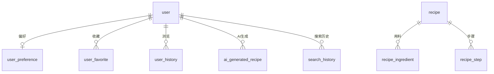

# 数据库设计文档

> **版本**：v1.0  
> **更新**：2026-07-26  
> **数据库**：MySQL 8.x / InnoDB / utf8mb4

---

## 一、实体关系图

---

## 二、表清单（10 张）

| # | 表名 | 说明 | 核心索引 |
|---|------|------|----------|
| 1 | `user` | 用户表 | UNIQUE(openid) |
| 2 | `user_preference` | 用户偏好 | UNIQUE(user_id) |
| 3 | `recipe` | 菜谱主表 | INDEX(cuisine, difficulty, cook_method) |
| 4 | `recipe_ingredient` | 用料清单 | INDEX(recipe_id) |
| 5 | `recipe_step` | 教程步骤 | INDEX(recipe_id) |
| 6 | `ingredient` | 食材字典 | UNIQUE(name) |
| 7 | `user_favorite` | 收藏 | UNIQUE(user_id, recipe_id) |
| 8 | `user_history` | 浏览历史 | INDEX(user_id, viewed_at) |
| 9 | `ai_generated_recipe` | AI 生成记录 | INDEX(user_id) |
| 10 | `search_history` | 搜索历史 | INDEX(user_id, created_at) |

---

## 三、表结构详细设计

### 3.1 用户表 `user`

| 字段 | 类型 | 约束 | 说明 |
|------|------|------|------|
| id | BIGINT | PK, AUTO_INCREMENT | 用户ID |
| openid | VARCHAR(64) | UNIQUE, NOT NULL | 微信OpenID |
| nickname | VARCHAR(64) | — | 昵称 |
| avatar | VARCHAR(512) | — | 头像URL |
| phone | VARCHAR(20) | — | 手机号 |
| gender | TINYINT | DEFAULT 0 | 0未知 1男 2女 |
| status | TINYINT | DEFAULT 1 | 0禁用 1正常 |
| created_at | DATETIME | DEFAULT NOW() | 创建时间 |
| updated_at | DATETIME | ON UPDATE NOW() | 更新时间 |

### 3.2 用户偏好表 `user_preference`

| 字段 | 类型 | 约束 | 说明 |
|------|------|------|------|
| id | BIGINT | PK, AUTO_INCREMENT | — |
| user_id | BIGINT | UNIQUE, NOT NULL | 用户ID |
| taste | VARCHAR(128) | — | 口味偏好（麻辣/清淡/酸甜等） |
| taboo | VARCHAR(256) | — | 忌口食材（JSON数组） |
| cuisine | VARCHAR(128) | — | 偏好菜系（JSON数组） |
| difficulty | VARCHAR(32) | — | 难度偏好（简单/普通/困难） |
| cook_method | VARCHAR(128) | — | 烹饪方式偏好（JSON数组） |
| created_at | DATETIME | DEFAULT NOW() | — |
| updated_at | DATETIME | ON UPDATE NOW() | — |

### 3.3 菜谱表 `recipe`

| 字段 | 类型 | 约束 | 说明 |
|------|------|------|------|
| id | BIGINT | PK, AUTO_INCREMENT | — |
| name | VARCHAR(128) | NOT NULL | 菜名 |
| cover_image | VARCHAR(512) | — | 封面图URL |
| description | VARCHAR(512) | — | 简介 |
| cuisine | VARCHAR(64) | INDEX | 菜系 |
| difficulty | VARCHAR(16) | INDEX | 难度 |
| cook_method | VARCHAR(64) | INDEX | 烹饪方式 |
| cook_time | INT | — | 烹饪时间（分钟） |
| calories | INT | — | 热量（千卡） |
| view_count | INT | DEFAULT 0 | 浏览量 |
| favorite_count | INT | DEFAULT 0 | 收藏数 |
| status | TINYINT | DEFAULT 1 | 0下架 1上架 |
| source | VARCHAR(32) | DEFAULT 'system' | system/user/import |
| created_at | DATETIME | DEFAULT NOW() | — |
| updated_at | DATETIME | ON UPDATE NOW() | — |

### 3.4 用料表 `recipe_ingredient`

| 字段 | 类型 | 约束 | 说明 |
|------|------|------|------|
| id | BIGINT | PK, AUTO_INCREMENT | — |
| recipe_id | BIGINT | INDEX, NOT NULL | 菜谱ID |
| ingredient_id | BIGINT | — | 食材ID |
| name | VARCHAR(64) | NOT NULL | 食材名称 |
| amount | VARCHAR(32) | — | 用量 |
| sort_order | INT | DEFAULT 0 | 排序 |
| created_at | DATETIME | DEFAULT NOW() | — |

### 3.5 步骤表 `recipe_step`

| 字段 | 类型 | 约束 | 说明 |
|------|------|------|------|
| id | BIGINT | PK, AUTO_INCREMENT | — |
| recipe_id | BIGINT | INDEX, NOT NULL | 菜谱ID |
| step_no | INT | NOT NULL | 步骤序号 |
| content | TEXT | NOT NULL | 步骤说明 |
| image | VARCHAR(512) | — | 步骤配图URL |
| duration | INT | — | 预计耗时（分钟） |
| created_at | DATETIME | DEFAULT NOW() | — |

### 3.6 食材字典表 `ingredient`

| 字段 | 类型 | 约束 | 说明 |
|------|------|------|------|
| id | BIGINT | PK, AUTO_INCREMENT | — |
| name | VARCHAR(64) | UNIQUE, NOT NULL | 食材名 |
| category | VARCHAR(32) | — | 分类（蔬菜/肉类/海鲜/调料等） |
| created_at | DATETIME | DEFAULT NOW() | — |

### 3.7 收藏表 `user_favorite`

| 字段 | 类型 | 约束 | 说明 |
|------|------|------|------|
| id | BIGINT | PK, AUTO_INCREMENT | — |
| user_id | BIGINT | UNIQUE(user_id, recipe_id) | — |
| recipe_id | BIGINT | — | — |
| created_at | DATETIME | DEFAULT NOW() | — |

### 3.8 浏览历史表 `user_history`

| 字段 | 类型 | 约束 | 说明 |
|------|------|------|------|
| id | BIGINT | PK, AUTO_INCREMENT | — |
| user_id | BIGINT | INDEX | — |
| recipe_id | BIGINT | — | — |
| viewed_at | DATETIME | INDEX, DEFAULT NOW() | 浏览时间 |

### 3.9 AI 生成记录表 `ai_generated_recipe`

| 字段 | 类型 | 约束 | 说明 |
|------|------|------|------|
| id | BIGINT | PK, AUTO_INCREMENT | — |
| user_id | BIGINT | INDEX | — |
| mode | VARCHAR(16) | — | ingredients/name/creative |
| input_content | VARCHAR(512) | — | 用户输入 |
| result_json | JSON | — | AI生成结果 |
| rating | TINYINT | — | 用户评分 1-5 |
| feedback | VARCHAR(512) | — | 用户反馈 |
| created_at | DATETIME | DEFAULT NOW() | — |

### 3.10 搜索历史表 `search_history`

| 字段 | 类型 | 约束 | 说明 |
|------|------|------|------|
| id | BIGINT | PK, AUTO_INCREMENT | — |
| user_id | BIGINT | INDEX | — |
| keyword | VARCHAR(128) | NOT NULL | 搜索关键词 |
| created_at | DATETIME | INDEX, DEFAULT NOW() | — |

---

## 四、初始化数据

### 4.1 预置菜谱数据

初始化脚本预置 30+ 道经典家常菜，涵盖以下类别：

- **素菜**：番茄炒蛋、酸辣土豆丝、手撕包菜、蒜蓉西兰花、家常豆腐、地三鲜
- **荤菜**：红烧肉、鱼香肉丝、宫保鸡丁、糖醋排骨、回锅肉、可乐鸡翅
- **水产**：清蒸鲈鱼、红烧带鱼、蒜蓉粉丝虾、剁椒鱼头
- **汤品**：番茄蛋汤、紫菜蛋花汤、酸辣汤、冬瓜排骨汤
- **主食**：蛋炒饭、炒面、饺子、葱油拌面
- **川菜**：麻婆豆腐、水煮肉片、辣子鸡、夫妻肺片
- **粤菜**：白切鸡、叉烧、干炒牛河、煲仔饭

---

## 五、索引策略

1. **高频查询字段建索引**：`cuisine`, `difficulty`, `cook_method` 组合查询
2. **唯一约束防重复**：收藏、历史、偏好均通过唯一约束去重
3. **时间降序索引**：`viewed_at`, `created_at` 用于分页排序
4. **外键关联索引**：`recipe_id`, `user_id` 等关联字段均建索引

---

## 六、Redis 缓存设计

| 缓存 Key | 类型 | TTL | 说明 |
|----------|------|-----|------|
| `jtcsm:token:{userId}` | String | 7天 | JWT 黑名单 |
| `jtcsm:ai:limit:{userId}:{date}` | String | 24h | AI 调用次数 |
| `jtcsm:ai:cache:{MD5}` | String | 24h | AI 生成缓存 |
| `jtcsm:recipe:hot` | ZSet | 1h | 热门菜谱 Top10 |
| `jtcsm:recipe:detail:{id}` | String | 30min | 菜谱详情缓存 |
