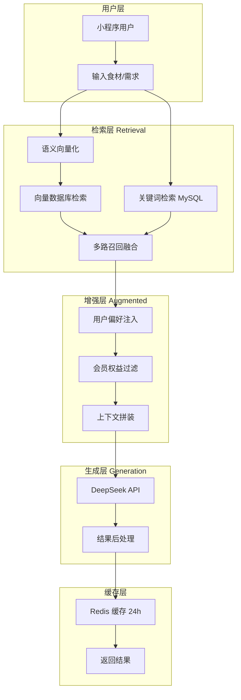
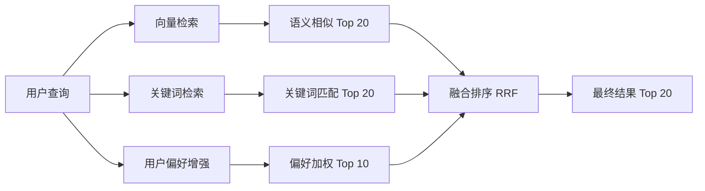
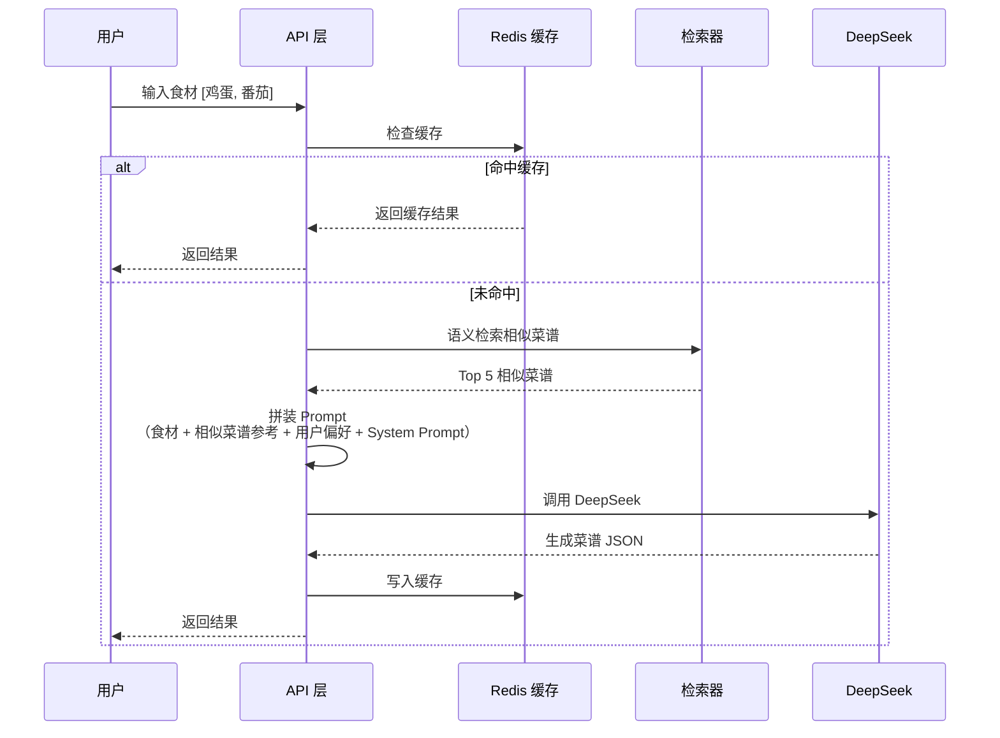
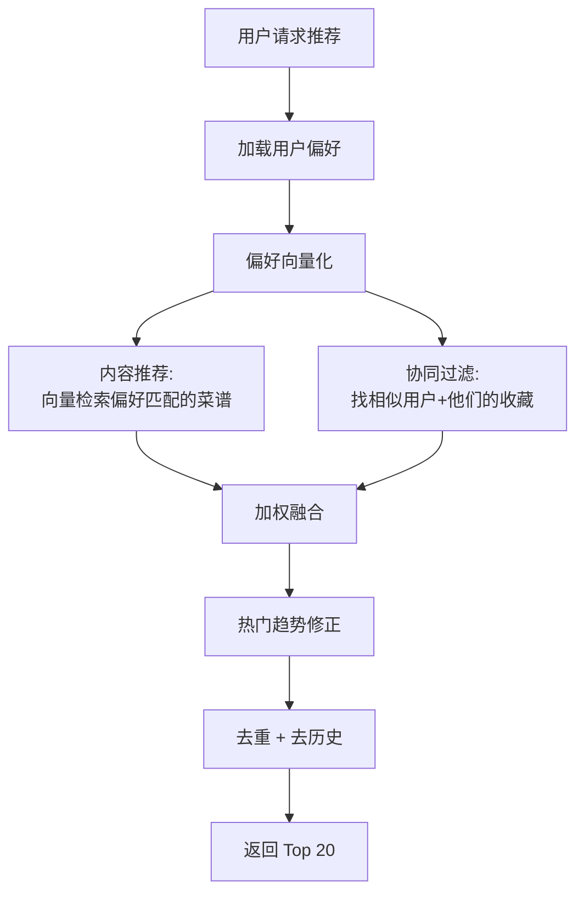

# RAG 架构设计文档

> **版本**：v1.0  
> **更新**：2026-07-26  
> **用途**：基于 RAG（检索增强生成）架构设计 AI 菜谱推荐系统

---

## 一、架构概述

本系统采用 **RAG（Retrieval-Augmented Generation）** 架构，将传统菜谱数据库中的精确检索与 AI 大模型的生成能力相结合，实现更智能、更精准的菜谱推荐与生成。



---

## 二、核心组件

### 2.1 向量数据库选型

| 方案 | 适用场景 | 优势 | 劣势 |
|------|----------|------|------|
| **Milvus**（推荐） | 大规模菜谱库 | 高性能、分布式、生态完善 | 部署稍复杂 |
| **Pinecone** | 快速上线 | 免运维、开箱即用 | 成本随规模增长 |
| **pgvector** | 已有 PostgreSQL | 无需额外部署 | 性能不如专用方案 |
| **Redis + RedisSearch** | 已有 Redis 集群 | 复用基础设施 | 向量能力有限 |

**推荐选择**：开发阶段使用 **pgvector**（减少基础设施复杂度），生产阶段迁移 **Milvus**。

### 2.2 Embedding 模型

| 模型 | 维度 | 中文效果 | 说明 |
|------|:---:|:---:|------|
| **text2vec-large-chinese** | 1024 | ⭐⭐⭐⭐⭐ | 开源免费，中文效果好 |
| m3e-base | 768 | ⭐⭐⭐⭐ | 轻量级，部署简单 |
| OpenAI text-embedding-3-small | 1536 | ⭐⭐⭐⭐ | 需外网 + API 费用 |
| DeepSeek Embedding | 1536 | ⭐⭐⭐⭐ | 与生成模型同源 |

**推荐选择**：`text2vec-large-chinese`，开源、免费、中文效果最优。

---

## 三、检索策略

### 3.1 多路召回



### 3.2 混合检索流程

1. **向量检索**：将用户输入（食材列表 / 菜名 / 需求描述）转为 Embedding，在向量库中检索语义最相近的菜谱
2. **关键词检索**：在 MySQL 中对 `cuisine`、`difficulty`、`cook_method`、`name` 字段进行 LIKE / FULLTEXT 匹配
3. **用户偏好增强**：根据用户偏好（口味/忌口/菜系）对候选集加权
4. **RRF 融合排序**：使用 Reciprocal Rank Fusion 算法合并多路结果
5. **会员过滤**：非 VIP 用户移除 `is_vip_only=1` 的菜谱

### 3.3 数据索引

**菜谱向量化数据模型：**

```json
{
  "recipe_id": 1,
  "vector": [0.023, -0.154, ...],  // 1024 维
  "metadata": {
    "name": "番茄炒蛋",
    "cuisine": "家常",
    "difficulty": "简单",
    "cook_method": "炒",
    "ingredients": ["番茄", "鸡蛋", "盐", "糖"],
    "description": "经典家常菜，简单易做"
  }
}
```

**索引内容：**
- 菜名 + 描述 + 食材列表 + 菜系标签的拼接文本 → Embedding
- 每次菜谱新增/修改时重新向量化

---

## 四、AI 生成 Pipeline

### 4.1 食材生成模式（mode: ingredients）



### 4.2 Prompt 拼装策略

```
System Prompt（固定）
+ 用户输入食材/菜名
+ 检索到的相似菜谱（作为参考样例）
+ 用户偏好（口味/忌口）
+ 生成约束（仅中餐/JSON格式/无markdown）
```

---

## 五、个性化推荐引擎

### 5.1 推荐因子

| 因子 | 权重 | 说明 |
|------|:---:|------|
| 用户偏好匹配 | 0.35 | 口味、菜系、烹饪方式对齐程度 |
| 协同过滤 | 0.25 | 相似用户的行为数据 |
| 热门趋势 | 0.20 | 全站浏览/收藏趋势 |
| 时令季节 | 0.10 | 时节与食材的匹配度 |
| 新鲜度 | 0.10 | 用户未浏览过的新菜谱 |

### 5.2 推荐流程



### 5.3 冷启动策略

新用户（无行为数据）：

1. **热门推荐兜底**：返回全站热门 Top 20
2. **引导设置偏好**：首次使用时引导填写口味、忌口信息
3. **即时反馈学习**：首次浏览/收藏行为后立即更新推荐权重

---

## 六、降级策略

| 场景 | 降级方案 |
|------|----------|
| 向量数据库不可用 | 退化为纯关键词搜索 + 热门推荐 |
| DeepSeek API 超时 | 返回 3 道预置兜底菜谱（番茄炒蛋/酸辣土豆丝/红烧肉） |
| Redis 不可用 | 跳过缓存，直接查 MySQL + 调 DeepSeek |
| 所有降级失效 | 返回静态热门菜谱列表 |

**兜底菜谱清单：**

1. **番茄炒蛋** — 难度：简单，时间：15分钟
2. **酸辣土豆丝** — 难度：简单，时间：20分钟
3. **红烧肉** — 难度：普通，时间：60分钟
4. **可乐鸡翅** — 难度：简单，时间：30分钟
5. **麻婆豆腐** — 难度：普通，时间：25分钟

---

## 七、技术实现路线

### 阶段一：基础检索（Step 1-5）
- MySQL 关键词搜索 + Elasticsearch（可选）
- 规则引擎推荐（基于偏好字段匹配）

### 阶段二：AI 集成（Step 8）
- DeepSeek API 接入
- 三种生成模式
- Redis 缓存层

### 阶段三：RAG 增强（后期迭代）
- 部署向量数据库（pgvector → Milvus）
- 菜谱向量化 + 语义检索
- 多路召回 + RRF 融合

### 阶段四：智能推荐（后期迭代）
- 协同过滤 + 内容推荐
- A/B 实验框架
- 推荐效果监控
