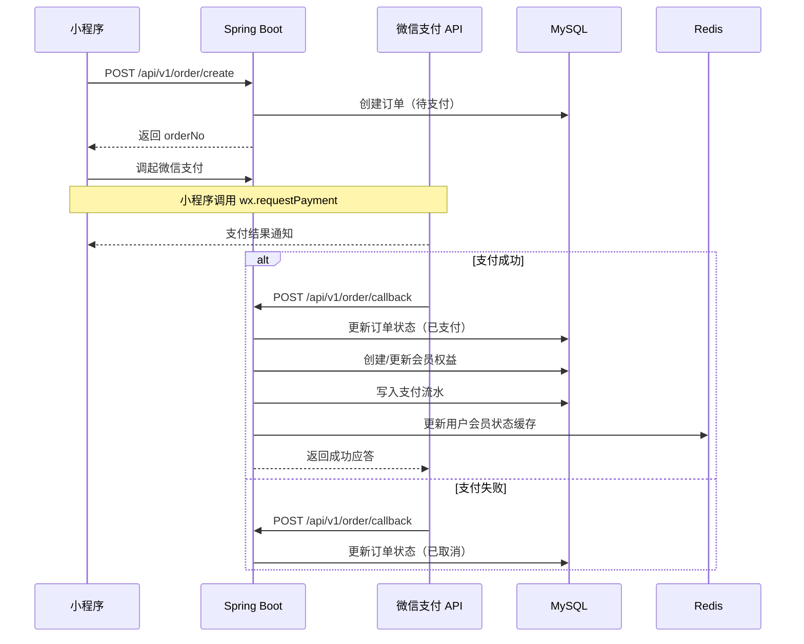
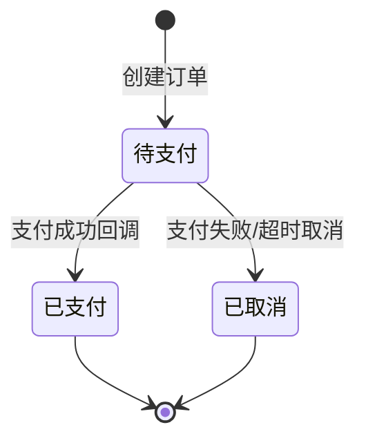

# 微信支付对接文档

> **版本**：v1.0  
> **更新**：2026-07-26  
> **适用场景**：微信小程序内会员套餐支付

---

## 一、支付流程概览



---

## 二、环境配置

### 2.1 开发环境（本地）

使用**模拟支付回调**替代真实微信支付，通过 `POST /api/v1/order/callback` 手动触发支付成功。

```yaml
# application-dev.yml
wechat:
  pay:
    enabled: false                 # 关闭真实支付
    mock-callback: true            # 开启模拟回调
```

### 2.2 生产环境

```yaml
# application-prod.yml
wechat:
  pay:
    enabled: true
    mch-id: ${WECHAT_MCH_ID}             # 商户号
    mch-serial-no: ${WECHAT_MCH_SERIAL}  # 商户证书序列号
    api-v3-key: ${WECHAT_API_V3_KEY}     # API v3 密钥
    private-key-path: ${WECHAT_PRIVATE_KEY_PATH}  # 商户私钥路径
    notify-url: https://api.your-domain.com/api/v1/order/callback
    app-id: ${WECHAT_APP_ID}             # 小程序 AppID
```

---

## 三、订单创建 API

### 3.1 接口定义

```
POST /api/v1/order/create
Header: Authorization: Bearer {token}
```

### 3.2 请求参数

```json
{
  "planId": 1
}
```

### 3.3 后端处理逻辑

```java
// OrderService.createOrder()
public OrderVO createOrder(Long userId, Long planId) {
    // 1. 校验套餐是否存在且有效
    MembershipPlan plan = planMapper.selectById(planId);
    if (plan == null || plan.getIsEnabled() == 0) {
        throw new BusinessException("套餐不存在或已下架");
    }

    // 2. 限流检查（10次/小时）
    String limitKey = "jtcsm:order:limit:" + userId + ":" + LocalDateTime.now().getHour();
    Long count = redisTemplate.opsForValue().increment(limitKey);
    if (count == 1) redisTemplate.expire(limitKey, 1, TimeUnit.HOURS);
    if (count > 10) throw new BusinessException("下单过于频繁，请稍后再试");

    // 3. 生成订单号：JTCSM + yyyyMMdd + 6位随机数
    String orderNo = generateOrderNo();

    // 4. 创建订单记录
    Order order = new Order();
    order.setOrderNo(orderNo);
    order.setUserId(userId);
    order.setPlanId(planId);
    order.setAmount(plan.getPrice());
    order.setStatus(OrderStatus.PENDING.getCode());
    orderMapper.insert(order);

    // 5. 返回订单信息
    return OrderVO.builder()
        .orderNo(orderNo)
        .amount(plan.getPrice())
        .planName(plan.getName())
        .build();
}
```

### 3.4 订单号规则

```
格式：JTCSM + yyyyMMddHHmmss + 4位随机数
示例：JTCSM20260726143015A3F2

生成逻辑：
- 前缀：JTCSM（项目标识）
- 时间戳：精确到秒
- 随机后缀：4位大写字母+数字（防重复）
```

---

## 四、支付回调处理

### 4.1 生产环境回调

微信支付 API v3 回调处理：

```java
// OrderController.paymentCallback()
@PostMapping("/api/v1/order/callback")
public Result<Void> paymentCallback(@RequestBody String body,
                                     @RequestHeader("Wechatpay-Serial") String serial,
                                     @RequestHeader("Wechatpay-Signature") String signature,
                                     @RequestHeader("Wechatpay-Timestamp") String timestamp,
                                     @RequestHeader("Wechatpay-Nonce") String nonce) {
    // 1. 验签
    if (!wechatPayService.verifySignature(body, serial, signature, timestamp, nonce)) {
        log.warn("微信支付回调验签失败");
        return Result.fail("验签失败");
    }

    // 2. 解密报文
    WechatPayCallbackData data = wechatPayService.decryptCallback(body);
    log.info("收到支付回调: orderNo={}, transactionId={}, status={}",
        data.getOutTradeNo(), data.getTransactionId(), data.getTradeState());

    // 3. 处理订单
    if ("SUCCESS".equals(data.getTradeState())) {
        orderService.handlePaymentSuccess(data.getOutTradeNo(), data.getTransactionId());
    }

    // 4. 返回应答
    return Result.ok();
}
```

### 4.2 开发环境模拟回调

```java
// OrderController.mockPaymentCallback()
@PostMapping("/api/v1/order/callback")
public Result<MembershipVO> mockPaymentCallback(@RequestBody MockPayRequest request) {
    // 开发环境直接更新订单状态
    log.info("模拟支付回调: orderNo={}", request.getOrderNo());

    Order order = orderMapper.selectOne(
        new LambdaQueryWrapper<Order>()
            .eq(Order::getOrderNo, request.getOrderNo())
    );
    if (order == null) {
        return Result.fail("订单不存在");
    }
    if (order.getStatus() != OrderStatus.PENDING.getCode()) {
        return Result.fail("订单状态异常：" + order.getStatus());
    }

    // 更新订单
    order.setStatus(OrderStatus.PAID.getCode());
    order.setPayTime(LocalDateTime.now());
    orderMapper.updateById(order);

    // 写入支付流水
    PaymentRecord record = new PaymentRecord();
    record.setOrderId(order.getId());
    record.setTransactionId(request.getTransactionId());
    record.setPayType(request.getPayType());
    record.setAmount(order.getAmount());
    record.setStatus(1);
    paymentRecordMapper.insert(record);

    // 激活会员
    MembershipVO result = membershipService.activateMembership(order.getUserId(), order.getPlanId());

    return Result.ok(result);
}
```

---

## 五、会员激活逻辑

```java
// MembershipService.activateMembership()
@Transactional
public MembershipVO activateMembership(Long userId, Long planId) {
    MembershipPlan plan = planMapper.selectById(planId);

    LocalDateTime now = LocalDateTime.now();
    LocalDateTime expireTime;

    // 查询现有会员
    UserMembership existing = userMembershipMapper.selectOne(
        new LambdaQueryWrapper<UserMembership>()
            .eq(UserMembership::getUserId, userId)
    );

    if (existing != null && existing.getStatus() == 1
        && existing.getExpireTime().isAfter(now)) {
        // 已有有效会员，叠加时长
        expireTime = existing.getExpireTime().plusDays(plan.getDays());
        existing.setExpireTime(expireTime);
        existing.setPlanId(planId);
        userMembershipMapper.updateById(existing);
    } else {
        // 无有效会员，新建
        expireTime = now.plusDays(plan.getDays());
        UserMembership membership = new UserMembership();
        membership.setUserId(userId);
        membership.setPlanId(planId);
        membership.setStartTime(now);
        membership.setExpireTime(expireTime);
        membership.setStatus(1);
        userMembershipMapper.insert(membership);
    }

    // 更新 user 表的 is_vip 和 vip_expire_time
    User user = new User();
    user.setId(userId);
    user.setIsVip(1);
    user.setVipExpireTime(expireTime);
    userMapper.updateById(user);

    // 清除会员状态缓存
    redisTemplate.delete("jtcsm:vip:status:" + userId);

    log.info("会员激活成功: userId={}, planName={}, expireTime={}",
        userId, plan.getName(), expireTime);

    return MembershipVO.builder()
        .vipExpireTime(expireTime)
        .planName(plan.getName())
        .build();
}
```

---

## 六、订单状态机



| 状态码 | 状态 | 说明 |
|:---:|------|------|
| 0 | 待支付 | 订单创建后的初始状态 |
| 1 | 已支付 | 支付回调成功 |
| 2 | 已取消 | 支付失败或用户取消 |

---

## 七、异常处理

| 异常场景 | 处理方式 |
|----------|----------|
| 重复回调 | 检查订单状态，若已支付则直接返回成功 |
| 验签失败 | 记录日志，返回 401 拒绝 |
| 订单不存在 | 记录告警日志，返回 404 |
| 套餐不存在 | 记录异常订单，人工介入 |
| 会员激活失败 | 事务回滚，订单保持已支付，后台告警 |
| 回调超时 | 微信支付会重试，需保证幂等 |

---

## 八、定时任务

### 8.1 订单超时取消

```java
// 每 5 分钟执行一次
@Scheduled(cron = "0 */5 * * * ?")
public void cancelTimeoutOrders() {
    LocalDateTime timeout = LocalDateTime.now().minusMinutes(30);
    List<Order> timeoutOrders = orderMapper.selectList(
        new LambdaQueryWrapper<Order>()
            .eq(Order::getStatus, OrderStatus.PENDING.getCode())
            .lt(Order::getCreatedAt, timeout)
    );
    for (Order order : timeoutOrders) {
        order.setStatus(OrderStatus.CANCELLED.getCode());
        orderMapper.updateById(order);
        log.info("订单超时取消: orderNo={}", order.getOrderNo());
    }
}
```

### 8.2 会员过期检测

```java
// 每天凌晨执行一次
@Scheduled(cron = "0 0 2 * * ?")
public void checkExpiredMembership() {
    List<UserMembership> expired = userMembershipMapper.selectList(
        new LambdaQueryWrapper<UserMembership>()
            .eq(UserMembership::getStatus, 1)
            .lt(UserMembership::getExpireTime, LocalDateTime.now())
    );
    for (UserMembership m : expired) {
        m.setStatus(0);
        userMembershipMapper.updateById(m);

        // 更新 user 表
        User user = new User();
        user.setId(m.getUserId());
        user.setIsVip(0);
        userMapper.updateById(user);

        // 清除缓存
        redisTemplate.delete("jtcsm:vip:status:" + m.getUserId());
    }
    log.info("过期会员清理完成，共 {} 条", expired.size());
}
```

---

## 九、安全检查清单

- [ ] API Key 不硬编码，从环境变量读取
- [ ] 支付回调验签逻辑完整
- [ ] 回调接口幂等处理
- [ ] 订单金额在后端计算，不信任前端传值
- [ ] 数据库事务保证订单与会员状态一致性
- [ ] 敏感操作记录完整日志
- [ ] 接口限流防止刷单
